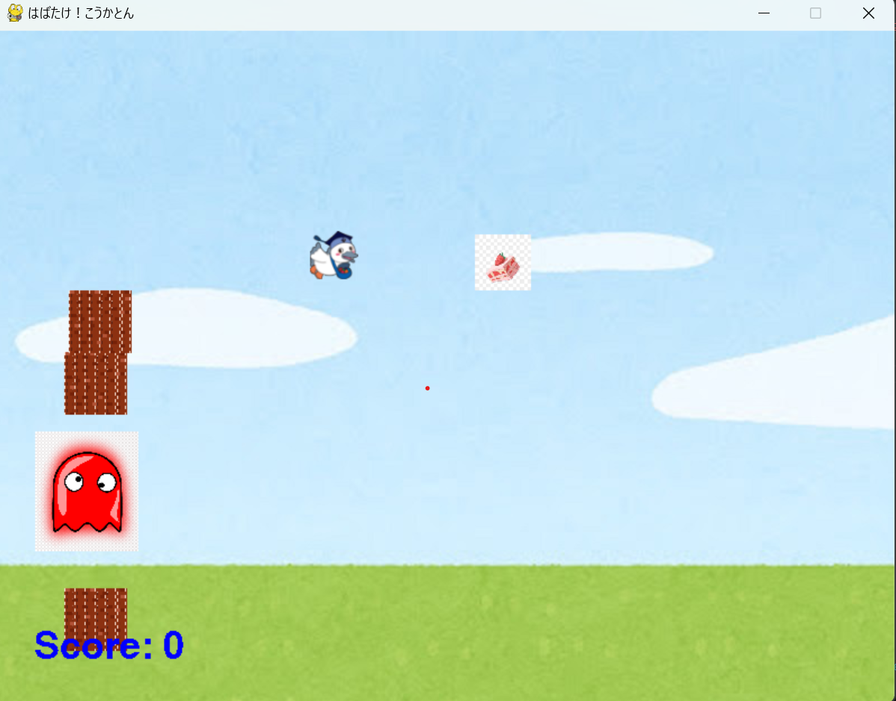

# 国家マン

## 実行環境の必要条件
* python >= 3.10
* pygame >= 2.1

## ゲームの概要
* 敵や障害物をよけ続ける

## ゲームの遊び方
* 矢印キーでこうかとんを操作し、障害物や敵をよける
* 敵にあたるとゲームオーバーになる。

## ゲームの実装
### 共通基本機能
* キャラクター描画、背景

### 分担追加機能
* こうかとん挙動（壁を乗り越えるため減速、敵に触れたらゲームオーバー）　いぶき
* 敵の挙動　いっせい
* 壁作成 ひろや
* スコア（敵を倒せるようにする＋１０ｐ）　そうた
* 無敵（アイテム取ったら無敵）　りょうた

* 
### ToDo

### メモ

